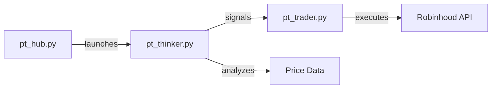

# MkDocs with Dracula Theme Setup

## Installation

```bash
pip install mkdocs mkdocs-material
```

Note: We use mkdocs-material as the base theme and customize it to Dracula colors.

## Configuration

Create `mkdocs.yml` in project root:

```yaml
site_name: PowerTrader AI Documentation
site_description: Complete guide to PowerTrader AI - Automated crypto trading with AI
site_author: PowerTrader AI Community
site_url: https://yourusername.github.io/PowerTrader_AI

repo_name: PowerTrader_AI
repo_url: https://github.com/yourusername/PowerTrader_AI
edit_uri: edit/main/docs/

theme:
  name: material
  custom_dir: docs/overrides

  # Dracula color scheme
  palette:
    # Dark mode (Dracula)
    - scheme: dracula
      primary: deep purple
      accent: pink
      toggle:
        icon: material/brightness-4
        name: Switch to light mode

    # Light mode (optional, for accessibility)
    - scheme: default
      primary: deep purple
      accent: pink
      toggle:
        icon: material/brightness-7
        name: Switch to dark mode

  font:
    text: Roboto
    code: Fira Code

  features:
    - navigation.instant
    - navigation.tracking
    - navigation.tabs
    - navigation.tabs.sticky
    - navigation.sections
    - navigation.expand
    - navigation.top
    - navigation.indexes
    - toc.follow
    - toc.integrate
    - search.suggest
    - search.highlight
    - search.share
    - content.code.copy
    - content.code.annotate
    - content.tabs.link

  icon:
    repo: fontawesome/brands/github
    logo: material/robot

extra_css:
  - stylesheets/dracula.css

extra_javascript:
  - javascripts/extra.js

markdown_extensions:
  # Code blocks
  - pymdownx.highlight:
      anchor_linenums: true
      line_spans: __span
      pygments_lang_class: true
  - pymdownx.inlinehilite
  - pymdownx.snippets
  - pymdownx.superfences:
      custom_fences:
        - name: mermaid
          class: mermaid
          format: !!python/name:pymdownx.superfences.fence_code_format

  # Admonitions
  - admonition
  - pymdownx.details

  # Lists
  - def_list
  - pymdownx.tasklist:
      custom_checkbox: true

  # Tables
  - tables
  - attr_list
  - md_in_html

  # Tabs
  - pymdownx.tabbed:
      alternate_style: true

  # Other
  - abbr
  - footnotes
  - pymdownx.critic
  - pymdownx.caret
  - pymdownx.keys
  - pymdownx.mark
  - pymdownx.tilde
  - pymdownx.emoji:
      emoji_index: !!python/name:material.extensions.emoji.twemoji
      emoji_generator: !!python/name:material.extensions.emoji.to_svg

plugins:
  - search:
      separator: '[\s\-,:!=\[\]()"/]+|(?!\b)(?=[A-Z][a-z])|\.(?!\d)|&[lg]t;'
  - tags
  - minify:
      minify_html: true

nav:
  - Home: index.md

  - Getting Started:
      - getting-started/index.md
      - Installation: getting-started/installation.md
      - Manual Setup: getting-started/manual-setup.md
      - System Requirements: getting-started/requirements.md

  - User Guide:
      - user-guide/index.md
      - First Run: user-guide/first-run.md
      - Robinhood API Setup: user-guide/robinhood-setup.md
      - Choosing Coins: user-guide/choosing-coins.md
      - Training the AI: user-guide/training.md
      - Starting Trading: user-guide/starting-trading.md
      - Monitoring Trades: user-guide/monitoring.md
      - Troubleshooting: user-guide/troubleshooting.md

  - Concepts:
      - concepts/index.md
      - How It Works: concepts/how-it-works.md
      - Trading Strategy: concepts/trading-strategy.md
      - Neural Levels: concepts/neural-levels.md
      - DCA System: concepts/dca-system.md
      - Risk Management: concepts/risk-management.md

  - Advanced:
      - advanced/index.md
      - Multiple Coins: advanced/multiple-coins.md
      - Customization: advanced/customization.md
      - Data Files: advanced/data-files.md
      - Performance Tuning: advanced/performance.md

  - Developers:
      - developers/index.md
      - Architecture: developers/architecture.md
      - Building Executables: developers/building.md
      - Contributing: developers/contributing.md
      - Testing: developers/testing.md
      - Code Standards: developers/code-standards.md

  - FAQ: faq.md
  - Changelog: changelog.md

extra:
  social:
    - icon: fontawesome/brands/github
      link: https://github.com/yourusername/PowerTrader_AI
    - icon: fontawesome/brands/facebook
      link: https://www.facebook.com/stephen.bryant.hughes

  analytics:
    provider: google
    property: G-XXXXXXXXXX  # Add your Google Analytics ID

  version:
    provider: mike

copyright: Copyright &copy; 2024 PowerTrader AI Contributors
```

## Custom Dracula Stylesheet

Create `docs/stylesheets/dracula.css`:

```css
/**
 * Dracula Theme for MkDocs Material
 * Based on Dracula color palette: https://draculatheme.com/
 */

:root {
  /* Dracula color palette */
  --dracula-bg: #282a36;
  --dracula-current-line: #44475a;
  --dracula-selection: #44475a;
  --dracula-fg: #f8f8f2;
  --dracula-comment: #6272a4;
  --dracula-cyan: #8be9fd;
  --dracula-green: #50fa7b;
  --dracula-orange: #ffb86c;
  --dracula-pink: #ff79c6;
  --dracula-purple: #bd93f9;
  --dracula-red: #ff5555;
  --dracula-yellow: #f1fa8c;
}

/* Override Material theme with Dracula colors */
[data-md-color-scheme="dracula"] {
  /* Background colors */
  --md-default-bg-color: var(--dracula-bg);
  --md-default-bg-color--light: var(--dracula-current-line);
  --md-default-bg-color--lighter: var(--dracula-selection);
  --md-default-bg-color--lightest: var(--dracula-comment);

  /* Foreground colors */
  --md-default-fg-color: var(--dracula-fg);
  --md-default-fg-color--light: var(--dracula-fg);
  --md-default-fg-color--lighter: var(--dracula-comment);
  --md-default-fg-color--lightest: var(--dracula-comment);

  /* Primary color */
  --md-primary-fg-color: var(--dracula-purple);
  --md-primary-fg-color--light: var(--dracula-purple);
  --md-primary-fg-color--dark: var(--dracula-purple);
  --md-primary-bg-color: var(--dracula-fg);
  --md-primary-bg-color--light: var(--dracula-fg);

  /* Accent color */
  --md-accent-fg-color: var(--dracula-pink);
  --md-accent-fg-color--transparent: rgba(255, 121, 198, 0.1);
  --md-accent-bg-color: var(--dracula-fg);
  --md-accent-bg-color--light: var(--dracula-fg);

  /* Code colors */
  --md-code-bg-color: var(--dracula-current-line);
  --md-code-fg-color: var(--dracula-green);

  /* Links */
  --md-typeset-a-color: var(--dracula-cyan);

  /* Admonition colors */
  --md-admonition-bg-color: var(--dracula-current-line);
}

/* Code block styling */
[data-md-color-scheme="dracula"] .highlight {
  background-color: var(--dracula-current-line);
}

[data-md-color-scheme="dracula"] .highlight .hll {
  background-color: var(--dracula-selection);
}

/* Syntax highlighting */
[data-md-color-scheme="dracula"] .highlight .c { color: var(--dracula-comment); } /* Comment */
[data-md-color-scheme="dracula"] .highlight .k { color: var(--dracula-pink); } /* Keyword */
[data-md-color-scheme="dracula"] .highlight .n { color: var(--dracula-fg); } /* Name */
[data-md-color-scheme="dracula"] .highlight .o { color: var(--dracula-pink); } /* Operator */
[data-md-color-scheme="dracula"] .highlight .s { color: var(--dracula-yellow); } /* String */
[data-md-color-scheme="dracula"] .highlight .nb { color: var(--dracula-cyan); } /* Name.Builtin */
[data-md-color-scheme="dracula"] .highlight .nf { color: var(--dracula-green); } /* Name.Function */
[data-md-color-scheme="dracula"] .highlight .nc { color: var(--dracula-cyan); } /* Name.Class */
[data-md-color-scheme="dracula"] .highlight .mi { color: var(--dracula-purple); } /* Number */
[data-md-color-scheme="dracula"] .highlight .bp { color: var(--dracula-purple); } /* Name.Builtin.Pseudo */

/* Navigation */
[data-md-color-scheme="dracula"] .md-nav__link--active {
  color: var(--dracula-pink);
}

[data-md-color-scheme="dracula"] .md-nav__link:hover {
  color: var(--dracula-cyan);
}

/* Search */
[data-md-color-scheme="dracula"] .md-search__input {
  background-color: var(--dracula-current-line);
  color: var(--dracula-fg);
}

[data-md-color-scheme="dracula"] .md-search__input::placeholder {
  color: var(--dracula-comment);
}

/* Tables */
[data-md-color-scheme="dracula"] .md-typeset table:not([class]) {
  border: 1px solid var(--dracula-current-line);
}

[data-md-color-scheme="dracula"] .md-typeset table:not([class]) th {
  background-color: var(--dracula-current-line);
  color: var(--dracula-purple);
}

[data-md-color-scheme="dracula"] .md-typeset table:not([class]) td {
  border-top: 1px solid var(--dracula-current-line);
}

/* Admonitions */
[data-md-color-scheme="dracula"] .admonition.tip {
  border-left-color: var(--dracula-green);
}

[data-md-color-scheme="dracula"] .admonition.warning {
  border-left-color: var(--dracula-orange);
}

[data-md-color-scheme="dracula"] .admonition.danger {
  border-left-color: var(--dracula-red);
}

[data-md-color-scheme="dracula"] .admonition.info {
  border-left-color: var(--dracula-cyan);
}

/* Inline code */
[data-md-color-scheme="dracula"] code {
  background-color: var(--dracula-current-line);
  color: var(--dracula-green);
}

/* Headers */
[data-md-color-scheme="dracula"] h1 {
  color: var(--dracula-purple);
}

[data-md-color-scheme="dracula"] h2 {
  color: var(--dracula-pink);
}

[data-md-color-scheme="dracula"] h3 {
  color: var(--dracula-cyan);
}
```

## Optional JavaScript

Create `docs/javascripts/extra.js`:

```javascript
/**
 * Extra JavaScript for MkDocs
 */

// Set Dracula as default theme
document.addEventListener('DOMContentLoaded', function() {
  const scheme = localStorage.getItem('data-md-color-scheme');
  if (!scheme) {
    document.querySelector('[data-md-component="palette"]').click();
  }
});
```

## Directory Structure

```
PowerTrader_AI/
├── mkdocs.yml
├── docs/
│   ├── index.md
│   ├── stylesheets/
│   │   └── dracula.css
│   ├── javascripts/
│   │   └── extra.js
│   ├── images/
│   │   ├── logo.png
│   │   └── screenshots/
│   ├── getting-started/
│   │   ├── index.md
│   │   ├── installation.md
│   │   └── manual-setup.md
│   ├── user-guide/
│   ├── concepts/
│   ├── advanced/
│   └── developers/
└── ...
```

## Commands

### Development
```bash
# Install dependencies
pip install mkdocs-material mkdocs-minify-plugin

# Start dev server with live reload
mkdocs serve

# Open browser to http://127.0.0.1:8000
```

### Build
```bash
# Build static site
mkdocs build

# Output in site/ directory
```

### Deploy
```bash
# Deploy to GitHub Pages
mkdocs gh-deploy

# Creates gh-pages branch and pushes to GitHub
# Site available at https://yourusername.github.io/PowerTrader_AI/
```

## Example Page with Dracula Theme Features

`docs/index.md`:

```markdown
# PowerTrader AI

Fully automated crypto trading powered by custom price prediction AI and structured DCA system.

## Features

**AI-Powered Predictions**
: Multi-timeframe pattern matching with weighted reliability scoring

**Automated Trading**
: Hands-free execution based on neural level signals

**Smart DCA**
: Tiered dollar-cost averaging with risk management

**Trailing Profits**
: Maximize gains with dynamic profit margins

## Quick Start

Choose your installation method:

=== "Executable (Recommended)"

    Download the installer for your platform:

    **Windows**
    ```bash
    # Download PowerTrader_AI_Setup.exe
    # Run installer
    # Done
    ```

    **macOS**
    ```bash
    # Download PowerTrader_AI.dmg
    # Drag to Applications
    # Done
    ```

=== "Manual Setup"

    For developers who want to run from source:

    ```bash
    git clone https://github.com/yourusername/PowerTrader_AI.git
    cd PowerTrader_AI
    python -m venv venv
    source venv/bin/activate  # On Windows: venv\Scripts\activate
    pip install -r requirements.txt
    python pt_hub.py
    ```

## Architecture



!!! warning "Important"
    This software places real trades automatically. You are responsible for everything it does to your money and your account.

## Next Steps

1. [Install PowerTrader AI](getting-started/installation.md)
2. [Set up Robinhood API](user-guide/robinhood-setup.md)
3. [Train the AI](user-guide/training.md)
4. [Start trading](user-guide/starting-trading.md)
```

## Color Reference

For custom styling in markdown:

```markdown
<!-- Highlight with Dracula colors -->
<span style="color: #bd93f9">Purple text</span>
<span style="color: #ff79c6">Pink text</span>
<span style="color: #8be9fd">Cyan text</span>
<span style="color: #50fa7b">Green text</span>
<span style="color: #f1fa8c">Yellow text</span>
<span style="color: #ffb86c">Orange text</span>
<span style="color: #ff5555">Red text</span>
```

## Testing

Verify theme works correctly:

```bash
mkdocs serve
```

Check:
- Background is Dracula dark (#282a36)
- Code blocks use Dracula current line (#44475a)
- Syntax highlighting uses Dracula colors
- Headers use purple/pink/cyan
- Links are cyan
- Navigation works
- Search functions properly
- Theme toggle switches correctly

## Deployment Checklist

Before deploying:

- [ ] All pages render correctly
- [ ] All images load
- [ ] All links work (no 404s)
- [ ] Search works
- [ ] Navigation is logical
- [ ] Code blocks have copy buttons
- [ ] Admonitions display correctly
- [ ] Tables are styled properly
- [ ] Mobile responsive
- [ ] Dracula theme loads by default

## Commit Strategy for Documentation

```bash
# Initial setup
git add mkdocs.yml docs/stylesheets/ docs/javascripts/
git commit -m "docs(mkdocs): configure Dracula theme"

# Add pages incrementally
git add docs/getting-started/installation.md
git commit -m "docs(guide): add installation instructions"

git add docs/images/install-*.png
git commit -m "docs(images): add installation screenshots"

# Deploy
mkdocs gh-deploy
git commit -m "docs(deploy): publish to GitHub Pages"
```
